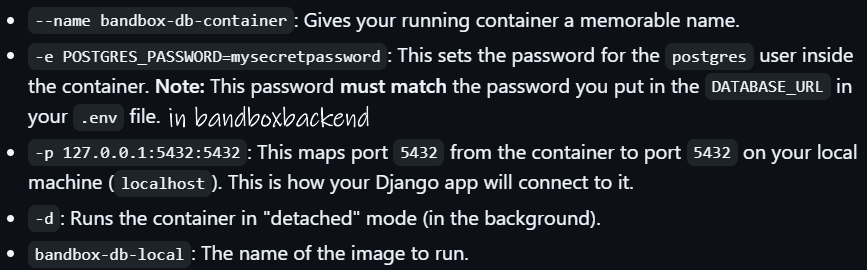
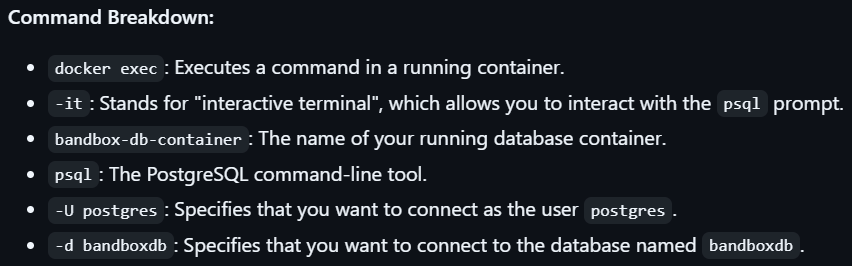

# Bandbox Database

This is the PostgreSQL database for the Bandbox application. It is hosted on Fly.io with persistent storage.

---

# Local Development

### 1. Build Docker image for local db
```
\bandboxdb> docker build -t bandbox-db-local .
```

### 2. Run the database container
- Run the image to create a brand new container. Use it the first time you want to set up your container.
    ```
    \bandboxdb> docker run --name bandbox-db-container -e POSTGRES_PASSWORD=mysecretpassword -p 127.0.0.1:5432:5432 -d bandbox-db-local
    ```
  - Command Breakdown:

    

- Manage the running local PostgreSQL database using these Docker commands:
    

### 3. Run Migrations
-  Now the backend can connect to the new local database. To create tables, in _bandboxbackend_, run:
    ```
    \bandboxbackend> python manage.py migrate
    ```

### 4. Access via CLI
- Access the PostgreSQL prompt (psql) inside the Docker container:
  - Start docker container: ```\bandboxdb> docker start bandbox-db-container```
  - You can exec only into a running container. Starting it lets you access the database shell 
    ```
    \user> docker exec -it bandbox-db-container psql -U postgres -d bandboxdb
    ```
    
  - Debug: ```\bandboxdb> docker logs bandbox-db-container```

---

# Production

### 1. Connect to the hosted db locally
- Default: ```\bandboxdb> flyctl proxy 5432```
- General (if port 5432 is busy): ```\user> flyctl proxy 5433:5432 -a bandboxdb```
  - Output (keep active): ```Proxying localhost:5433 to remote [bandboxdb.internal]:5432```

### 2. Set env variable for the session
```\bandboxdb> $env:PGPASSWORD="your_secure_password"```

### 3. Connect to postgres CLI
- Default: ```\bandboxdb> psql -h localhost -U postgres -d bandboxdb -p 5432```
- General: ```\user> psql -h 127.0.0.1 -U postgres -d bandboxdb -p 5433```

  - -h ```host``` (optional)
  - -U ```user```
  - -d ```database``` (optional)
  - -p ```port``` (default 5432)

---

## PostgreSQL Commands (inside psql shell)
```
1. List all databases
    \l or \list

2. Connect to a database
    \c your_database_name

3. List all tables in the current database
    \dt

4. Check current database
    \conninfo

5. Exit psql
    \q
```
- use table name in quotes (postgres expects everything in lower-case)

    ```bandboxdb=# SELECT * FROM "Bills_bill";```
